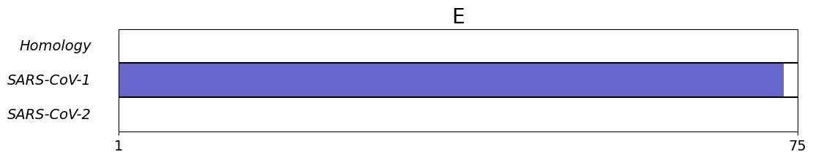
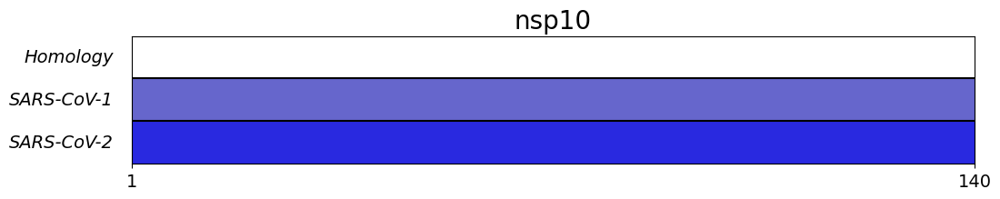
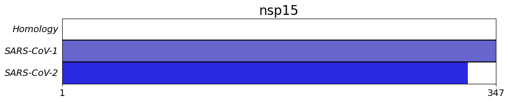
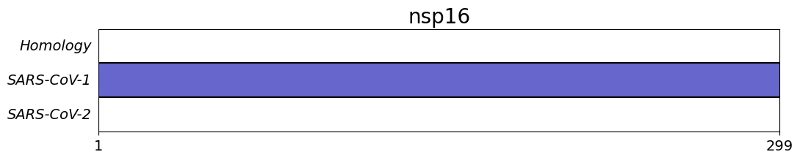
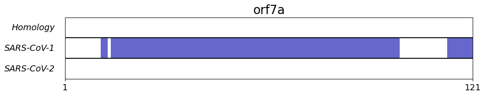
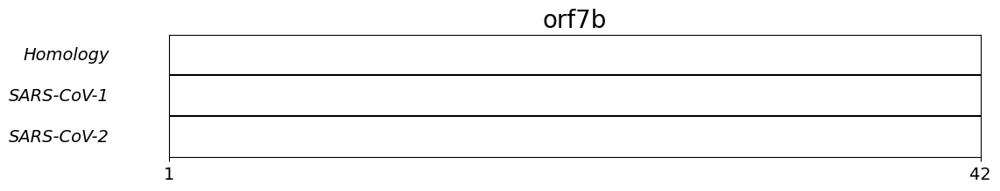

# SARS-CoV-2_structures

### Experimental and predicted structures for individual SARS-CoV-2 proteins

This repository (contains/will contain) experimental and predicted protein structures from SARS-CoV-2 along with analysis.

Leave suggestions for analyses you are interested in. 

Current status: 3/30/2020
* Individual PDB chains loaded
* Sequence coverage plots enabled

Next Updates:
* Addition of homology models
* Chimera/pymol scripts

Later Updates:
* Homology model agreement

This repository is meant to be useful!  Please let me know if you have other analyses which will benefit your work.

---
### Structure Files
PDB structures for SARS-CoV-2 sequences are found in:
`./proteins/protein_name/SARS-CoV-2_pdbs`

PDB structures for SARS-CoV-1 homologues are found in: 
`./proteins/protein_name/SARS-CoV-2_pdbs`

### Sequence Coverage
Sequence coverage plots show the residues described by SARS-CoV-2 pdbs (bottom), SARS-CoV-1 pdbs (middle) and homology models (top, not implemented yet)

Plots are constructed using `./scripts/structure_coverage.py`

All plots are found in `./figures/sequence_coverage/`

### Building the Database

The database of PDB files is populated using `./scripts/download_pdbs_and_extract_chains.py`

This utilizes the manually curated dictionaries found in the header of `./scripts/utilities.py` that link protein_name to (pdb, chain_id)'s 

### Homology model datasets

Homology model sets which are/will be incorporated into the database:
* [SWISS-PROT](https://swissmodel.expasy.org/repository/species/2697049)
* [FeigLab](https://github.com/feiglab/sars-cov-2-proteins)
* [Korkin Lab](http://korkinlab.org/wuhan)
* [AlphaFold](https://deepmind.com/research/open-source/computational-predictions-of-protein-structures-associated-with-COVID-19)
* [MODELLER](https://modbase.compbio.ucsf.edu/modweb/) - models currently building

Other useful structures:
* Tristan Croll's [ISOLDE refined PDB structures](https://drive.google.com/drive/folders/1S5qJtCnK00NrcbwwBNgImUMewhiBkyPa)

Please let me know if you have other structure predicitons that you would like to share!

### License

All code in the `./scripts/` folder is released under the GNU Lesser General Public License (LGPL).  See LICENSE.txt

