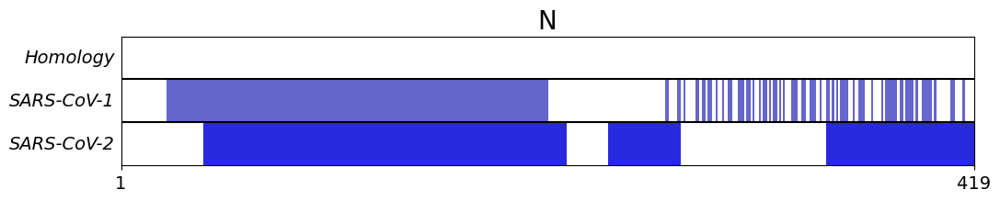
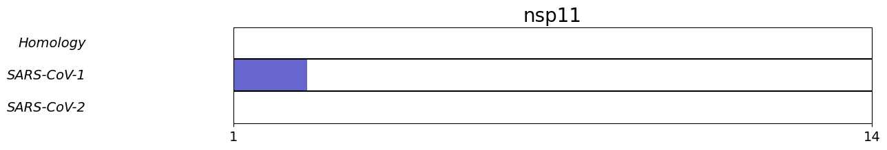
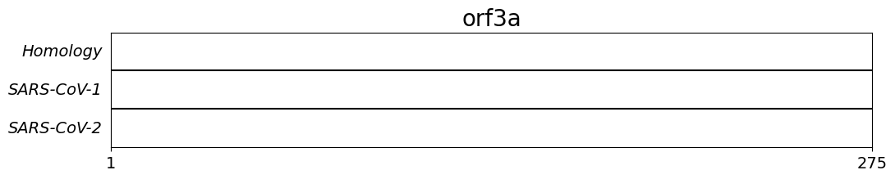

# SARS-CoV-2_structures
This repository (contains/will contain) experimental and predicted protein structures from SARS-CoV-2 along with analysis methods.

Current status: 3/30/2020
* Individual PDB chains loaded
* Sequence coverage plots enabled

Next Updates:
* Addition of homology models
* Chimera/pymol scripts

---
### Structure Files
PDB structures for SARS-CoV-2 sequences are found in:
`./proteins/protein_name/SARS-CoV-2_pdbs`

PDB structures for SARS-CoV-1 homologues are found in: 
`./proteins/protein_name/SARS-CoV-2_pdbs`

### Sequence Coverage
Sequence coverage plots show the residues described by SARS-CoV-2 pdbs (bottom), SARS-CoV-1 pdbs (middle) and homology models (top, not implemented yet)

Plots are constructed using `./scripts/structure_coverage.py`

All plots are found in `./figures/sequence_coverage/`

### Building the Database

The database of PDB files is populated using `./scripts/download_pdbs_and_extract_chains.py`

This utilizes the manually curated dictionaries found in the header of `./scripts/utilities.py` that link protein_name to (pdb, chain_id)'s 

